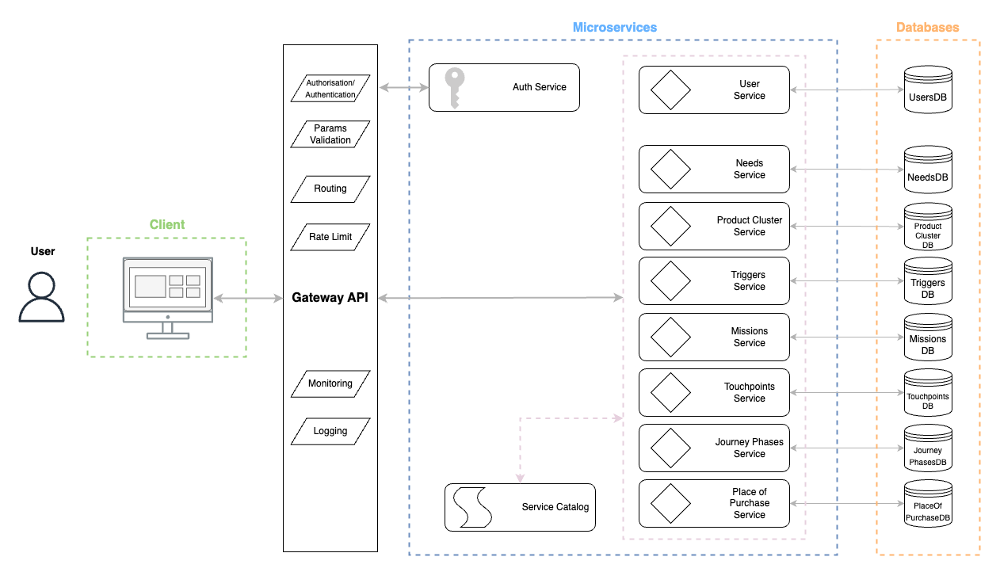

# Architecture

## Overview

How People Shop (HPS) is a digital, web-based solution designed to provide deep insights into consumer shopping behaviors, preferences, and experiences. It aims to drive consumer-centric decision-making by capturing and analyzing various facets of customer interactions and transactions across multiple touchpoints. The ultimate goal of the HPS product is to enhance the shopping experience of the customers by leveraging data-driven insights to inform business strategies, innovation, and operational improvements.

## Architectural Style

### Microservices Architecture & Database per Service

HPS is designed for multiple decision-makers located across various regions. Microservices architecture is chosen due to several key benefits that align with the project’s goals of scalability, flexibility, and maintainability. Moreover, it synchs perfectly with the Database per Service pattern, a framework for which each database is paired to a dedicated microservice.
Let’s explore the key features of these approaches:

1. **Scalability**:
    - **Independent Scaling**: Each microservice can be scaled independently based on its specific load and performance requirements. For instance, the User Service can be scaled differently from the Product Cluster Service depending on their usage patterns.
    - **Resource Optimization**: Allows efficient use of resources by allocating them precisely where needed, avoiding over-provisioning.
2. **Flexibility**:
    - **Technology Heterogeneity**: Each microservice can use different technologies best suited for its functionality. This allows leveraging various tools, languages, and databases, optimizing performance and productivity.
    - **Decentralized Development**: Different teams can develop, deploy, and manage microservices independently. This promotes faster development cycles and reduces bottlenecks.
3. **Maintainability**:
    - **Isolation**: Each microservice is an independent module, making it easier to maintain and update without affecting the entire system. This isolation helps in managing changes, fixing bugs, and adding new features more efficiently.
    - **Smaller Codebase**: The microservices approach results in smaller, more manageable codebases, reducing complexity and making the system easier to understand and modify.
4. **Fault Isolation**:
    - **Resilience**: If one microservice fails, it does not impact the entire system. This isolation of faults ensures higher availability and reliability of the overall system.

### RESTful APIs

RESTful APIs are chosen for inter-service communication and client interactions due to their simplicity, scalability, and standardization:

1. **Simplicity**:
    - **Ease of Use**: RESTful APIs use standard HTTP methods (GET, POST, PUT, DELETE), which are easy to understand and implement. This simplicity accelerates development and reduces errors.
    - **Statelessness**: Each API request contains all the information needed to process it, eliminating the need for the server to store session state. This statelessness improves scalability and reliability.
2. **Scalability**:
    - **Caching**: RESTful APIs can leverage HTTP caching mechanisms to reduce server load and improve response times.
    - **Load Balancing**: Statelessness and the uniform interface of RESTful APIs make it easier to distribute the load across multiple servers.
3. **Interoperability**:
    - **Standard Protocols**: RESTful APIs use standard web protocols and data formats (such as JSON and XML), ensuring compatibility with a wide range of clients and services.
    - **Platform Agnostic**: RESTful APIs can be consumed by any client capable of making HTTP requests, regardless of the platform or programming language used.
4. **Maintainability**:
    - **Clear Separation**: The use of URIs for resource identification and standardized methods for operations ensures a clear separation of concerns, making APIs easier to maintain and extend.

## Components

### 1. Client

- **User Interface**:

    This is the front-end application accessed by users through web browsers.
    Designed applying Micro Frontends, an architectural pattern that draws inspiration from microservices, focusing specifically on the front-end layer.
    It involves breaking down a monolithic front-end application into smaller, loosely coupled, and independently deployable components.

    - **Responsibilities**:
        - Render dynamic content based on user interactions.
        - Collect user inputs and send requests to the backend services via the Gateway API.
        - Display data received from backend services.

### 2. Gateway API

API that acts as a single point of entry for various client requests. It serves as an intermediary between the clients and backend services.
The main functions of a Gateway API include:

- **Responsibilities**:
    - **Authorization/Authentication**:
        - Validates user credentials and ensures secure access to the system or to certain resources.
        - Manages tokens and sessions.
    - **Params Validation**:
        - Ensures incoming requests contain valid parameters before processing.
        - Prevents invalid or malicious data from reaching the backend services.
    - **Routing**:
        - Directs incoming API requests to the appropriate microservice.
    - **Rate Limit**:
        - Implements rate limiting to prevent abuse and ensure fair usage.
        - Protects the backend services from being overwhelmed by excessive requests.
    - **Monitoring**:
        - Collects metrics on API usage, performance, and errors.
        - Provides data for operational insights and alerting.
    - **Logging**:
        - Records details of each request and response.
        - Helps in troubleshooting, auditing, and analyzing usage patterns.

### 3. Microservices

Following the microservices system design patterns, each microservice is responsible for a specific domain or functionality, is independently deployable and scalable. They communicate with the Gateway API and other services as needed. Loose coupling is a fundamental characteristic of a microservices architecture and the database-per-service pattern extends this logic to a context in which data has to be retrieved from several databases. Each microservice independently stores and retrieves information from its own data store. By implementing the database-per-service pattern, the most suitable data stores (e.g., relational or non-relational databases) based on your application and business requirements can be chosen.

- <u>**Service Catalog**</u>

    Centralized registry that provides metadata about the services.
    It contains information such as:

    - **Service Names:** The unique identifiers for each service.
    - **Service Endpoints:** The URLs or network locations where the services can be accessed.
    - **Service Versions:** Information about different versions of the services that are available.
    - **Service Interfaces:** Details about the APIs, including request and response formats, that each service exposes.
    - **Service Dependencies:** Information on which other services or databases a particular service depends on.

    In terms of responsibilities, the Service Catalog:

    - Manages the registry of all available services and their instances.
    - Provides service discovery for microservices to locate each other.
    - Ensures that services can be dynamically added or removed without affecting the system's overall functionality.
    - Maintains metadata about each service, such as version, location, and status.

    It provides the following functionalities, which determine how it works:

    - **Registration:** When a new service instance starts, it registers itself with the service catalog, providing its metadata such as endpoint, version, and other necessary details.
    - **Heartbeat Mechanism:** Services periodically send heartbeat signals (ping) to the catalog to indicate that they are still alive. If a heartbeat is missed for a certain period, the catalog marks the service instance as unavailable.
    - **Lookup:** When a service needs to call another service, it queries the service catalog to get the current endpoint and other metadata of the target service.
    - **Deregistration:** When a service instance shuts down or is no longer available, it deregisters itself from the catalog, or the catalog automatically removes it after missing heartbeats.
- <u>**Auth Service**</u>
    - Supports the Gateway API in handling user authentication and authorization.
    - Manages user sessions and tokens.
- <u>**User Service**</u>
    - Manages user profiles, preferences, and related data.
    - Provides RESTful APIs to create, read, update, and delete user information.
    - **Database**: UsersDB.
- <u>**Needs Service**</u>
    - Allows to retrieve data, through RESTful APIs, from the Needs Database, which concerns:
        - **Replacement:** Customers looking to replace an existing item.
        - **Upgrade:** Customers looking to upgrade to a better version of an item.
        - **Remodel:** Customers involved in remodeling a space, seeking multiple items
    - **Database**: NeedsDB.
- <u>**Product Cluster Service**</u>
    - Allows to retrieve data, through RESTful APIs, from the Product Cluster Database, which concerns:
        - **Quick Pickers:** Products that are typically picked quickly, often impulse buys.
        - **Storage Solvers:** Products aimed at solving storage issues.
        - **Lasting Comfort:** Products that provide long-term comfort, such as furniture.
    - **Database**: ProductClusterDB.
- <u>**Triggers Service**</u>
    - Allows to retrieve data, through RESTful APIs, from the Triggers Database, which concerns:
        - **Price:** Purchases driven by discounts or price considerations.
        - **Time:** Purchases driven by the urgency or timing.
        - **Season:** Purchases influenced by the time of year.
        - **Event:** Purchases made in preparation for specific events (e.g., holidays).
        - **Retailer:** Influence of retailer promotions or marketing.
        - **Budget:** Purchases constrained or influenced by budget considerations.
    - **Database**: TriggersDB.
- <u>**Missions Service**</u>
    - Allows to retrieve data, through RESTful APIs, from the Missions Database, which concerns:
        - **Solution Seeking:** Customers looking for specific solutions to problems.
        - **Recreational Shopping:** Customers shopping for leisure or pleasure.
    - **Database**: MissionsDB.
- <u>**Touchpoints Service**</u>
    - Allows to retrieve data, through RESTful APIs, from the Touchpoints Database, which concerns:
        - **Brand Website:** Interactions on the IKEA website.
        - **Store:** Physical interactions in IKEA stores.
        - **Social Media:** Engagements on social media platforms.
        - **Online Stores:** Purchases made through IKEA’s or other online platforms.
    - **Database**: TouchpointsDB.
- <u>**Journey Phases Service**</u>
    - Allows to retrieve data, through RESTful APIs, from the Journey Phases Database, which concerns:
        - **Browsing, Filtering, Comparing:** Initial phase of looking at products.
        - **Exploration, Learning:** Researching and understanding products.
        - **Committing, Completion:** Making the final decision and purchasing.
    - **Database**: JourneyPhasesDB.
- <u>**Place of Purchase Service**</u>
    - Allows to retrieve data, through RESTful APIs, from the Place of Purchase Database, which concerns:
        - **Store:** Purchases made in physical stores.
        - **Online:** Purchases made through the online store.
    - **Database**: PlaceOfPurchaseDB.

## Communication Flow

1. **User Interaction**: The user interacts with the client application, the frontend, which sends a request to the Gateway API.
2. **Request Routing**: The Gateway API authenticates the request, validates parameters, and routes it to the appropriate microservice.
3. **Microservice Processing**: The microservice processes the request, which involves reading from its database.
4. **Response Generation**: The microservice generates a response and sends it back to the Gateway API.
5. **Client Response**: The Gateway API forwards the response to the client application, which elaborates and displays the result to the user.
