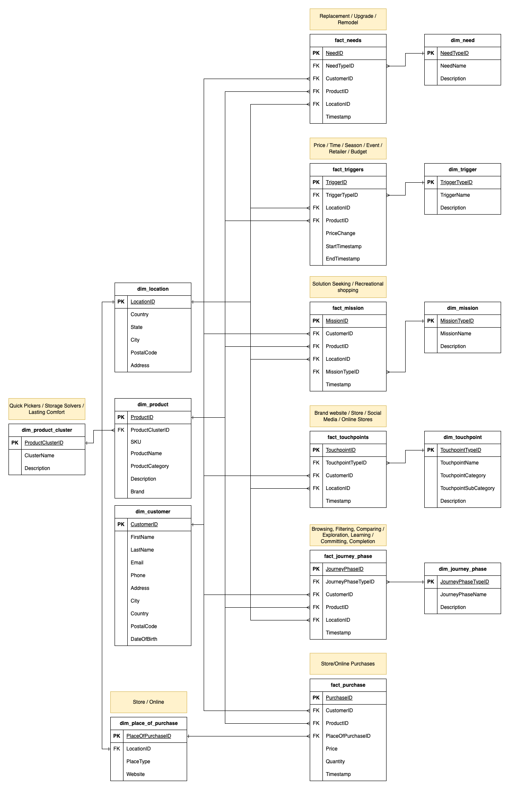

# Data Landscape

## Data Landscape Overview

The data landscape of the HPS system is designed to comprehensively capture and analyze the multifaceted aspects of customer behavior. Here below a brief overview of the key data entities:

1.	Needs: it captures the various needs that drive customers to shop, such as replacement, upgrade, or remodel. Each need can be associated with specific customer, product, and location information to provide context for their shopping motivations.
2.	Product Clusters: Products are grouped into clusters such as Quick Pickers, Storage Solvers, and Lasting Comfort. These clusters can help in understanding which categories of products appeal to different customer segments.
3.	Triggers: This entity is realted to events or conditions that trigger shopping activities, including price changes, seasonal events, and promotions. Analyzing these triggers helps identify factors that influence purchasing decisions.
4.	Missions: They represent the broader goals customers have when shopping, such as solution seeking or recreational shopping. This entity can help in tailoring offerings to meet specific customer intents.
5.	Touchpoints: This entity tracks customer interactions across various touchpoints, including the brand website, physical stores, social media, and online stores. It is essential for mapping the customer journey and optimizing each interaction.
6.	Journey Phases: The customer journey is divided into phases, from browsing and filtering to exploration, learning, committing, and completion. Understanding what happens during each of these pahses helps in identifying areas for improving the shopping experience.
7.	Place of Purchase: This entity indicates the locations where purchases are made, whether in-store or online. It provides insights into preferred shopping channels and helps optimize both physical and digital storefronts.

## Data Collection
The data pertaining to the entities mentioned above can be gathered from various sources. For some entities, data collection is straightforward, while others may necessitate a more creative approach:

- Transactional Systems: Capture data from sales transactions in both physical stores and online platforms.
    - Entities: Purchases, Place of Purchase
- Customer Relationship Management (CRM) Systems: Collect information about customer profiles, interactions, and preferences.
    - Entities: Customer, Needs, Missions
- Web and Mobile Analytics: Track browsing behavior, clicks, and other interactions on digital platforms.
    - Entities: Touchpoints, Journey Phases, Triggers
- Surveys and Feedback Forms: Gather direct feedback from customers regarding their needs and experiences.
    - Entities: Needs, Missions, Customer
- Social Media Monitoring: Capture mentions, reviews, and engagements related to the brand and products.
    - Entities: Touchpoints, Triggers
- IoT Devices: Use sensors and smart devices in stores to monitor customer movements and interactions.
    - Entities: Place of Purchase, Journey Phases

# Database Design
Here below the Entity Relationship Diagram that was designed to store, analyze and modify the data.



## Sample SQL queries
The objective of this section is to illustrate the efficacy of the designed databse by showcasing a series of SQL queries. These queries aim to provide actionable insights into customer behaviors, preferences, and interactions with the brand. By leveraging the structured data, we can uncover patterns and trends that help in strategic decision-making and optimizing the overall customer experience.

In particular, the sample queries focus on different facets of the customer journey, including:
- Identifying the most popular products for specific needs.
- Understanding common customer missions driving purchases.
- Analyzing the impact of price changes on buying behavior.
- Tracking customer interactions across various touchpoints.
- Determining preferred shopping channels for different product clusters.

1.	**Identify the top 5 products purchased by customers for specific needs (e.g., replacement, upgrade, or remodel) in the Netherlands**
    ```sql
    SELECT
        p.ProductName,
        COUNT(*) AS PurchaseCount
    FROM
        fact_needs fn
    JOIN
        dim_product p ON fn.ProductID = p.ProductID
    JOIN
        dim_need n ON fn.NeedTypeID = n.NeedTypeID
    WHERE
        n.NeedName IN ('Replacement', 'Upgrade', 'Remodel')
    GROUP BY
        p.ProductName
    ORDER BY
        PurchaseCount DESC
    LIMIT 5;
    ```

2. **Discover the most common customer mission type based on purchase data in Italy**
    ```sql
    SELECT
        m.MissionName,
        COUNT(*) AS MissionCount
    FROM
        fact_purchase fp
    JOIN
        fact_mission fm ON fp.CustomerID = fm.CustomerID AND fp.ProductID = fm.ProductID
    JOIN
        dim_mission m ON fm.MissionTypeID = m.MissionTypeID
    JOIN
        dim_location l ON fm.LocationID = l.LocationID
    WHERE
        l.Country = 'Italy'
    GROUP BY
        m.MissionName
    ORDER BY
        MissionCount DESC
    LIMIT 1;
    ```
3. **Compare Product Cluster Sales During a Promotional Campaign with Previous Semester Sales**

    The goal of this query is to compare the sales performance of products belonging to a specific product cluster during a promotional campaign that affected their prices, with the sales of those same products in the previous semester when there was no campaign. By analyzing the sales quantities during these two distinct periods, the query aims to highlight the impact of the promotional campaign on product sales and determine the effectiveness of the price change in driving customer purchases.

    ```sql
        WITH ProductClusterSales AS (
        SELECT
            fp.ProductID,
            p.ProductClusterID,
            pc.ClusterName,
            fp.Timestamp,
            fp.Quantity
        FROM
            fact_purchase fp
        JOIN
            dim_product p ON fp.ProductID = p.ProductID
        JOIN
            dim_product_cluster pc ON p.ProductClusterID = pc.ProductClusterID
        JOIN
            fact_triggers ft ON fp.ProductID = ft.ProductID
        WHERE
            ft.TriggerTypeID = (SELECT TriggerTypeID FROM dim_trigger WHERE TriggerName = 'QUICKPICKERS_10PERCDISC')
            AND ft.PriceChange IS NOT NULL
            AND fp.Timestamp BETWEEN ft.StartTimestamp AND ft.EndTimestamp
            AND pc.ClusterName = 'QuickPickers'
    ),
    PreviousSemesterSales AS (
        SELECT
            fp.ProductID,
            p.ProductClusterID,
            pc.ClusterName,
            SUM(fp.Quantity) AS TotalQuantity
        FROM
            fact_purchase fp
        JOIN
            dim_product p ON fp.ProductID = p.ProductID
        JOIN
            dim_product_cluster pc ON p.ProductClusterID = pc.ProductClusterID
        WHERE
            fp.Timestamp BETWEEN DATE_SUB((SELECT MIN(StartTimestamp) FROM fact_triggers WHERE PriceChange IS NOT NULL), INTERVAL 6 MONTH)
                            AND DATE_SUB((SELECT MIN(StartTimestamp) FROM fact_triggers WHERE PriceChange IS NOT NULL), INTERVAL 1 DAY)
            AND pc.ClusterName = 'QuickPickers'
        GROUP BY
            fp.ProductID, p.ProductClusterID, pc.ClusterName
    )
    SELECT
        pcs.ClusterName,
        SUM(pcs.Quantity) AS PromotionalPeriodSales,
        SUM(pss.TotalQuantity) AS PreviousSemesterSales,
        (SUM(pcs.Quantity) - SUM(pss.TotalQuantity)) AS SalesDifference
    FROM
        ProductClusterSales pcs
    JOIN
        PreviousSemesterSales pss ON pcs.ProductID = pss.ProductID
    GROUP BY
        pcs.ClusterName;
    ```

4. **Track sequential customer interactions from Social Media, to Website, to Physical Store Purchase in the Netherlands**

    Identify how many customers interact with the social media platforms, then visit the website to analyse the products, and finally visit a
        physical store completing a purchase.
    ```sql
    WITH SocialMediaInteractions AS (
        SELECT DISTINCT
            ft.CustomerID,
            ft.Timestamp AS SocialMediaTimestamp
        FROM
            fact_touchpoints ft
        JOIN
            dim_touchpoint tp ON ft.TouchpointTypeID = tp.TouchpointTypeID
        JOIN
            dim_location l ON ft.LocationID = l.LocationID
        WHERE
            tp.TouchpointCategory = 'Social Media'
            AND l.Country = 'Netherlands'
    ),
    WebsiteVisits AS (
        SELECT DISTINCT
            ft.CustomerID,
            ft.Timestamp AS WebsiteVisitTimestamp,
            smi.SocialMediaTimestamp
        FROM
            fact_touchpoints ft
        JOIN
            dim_touchpoint tp ON ft.TouchpointTypeID = tp.TouchpointTypeID
        JOIN
            dim_location l ON ft.LocationID = l.LocationID
        JOIN
            SocialMediaInteractions smi ON ft.CustomerID = smi.CustomerID
        WHERE
            tp.TouchpointName = 'Online Website'
            AND l.Country = 'Netherlands'
            AND ft.Timestamp > smi.SocialMediaTimestamp
    ),
    PhysicalStorePurchases AS (
        SELECT DISTINCT
            fp.CustomerID,
            fp.Timestamp AS PurchaseTimestamp,
            wv.WebsiteVisitTimestamp
        FROM
            fact_purchase fp
        JOIN
            dim_place_of_purchase pp ON fp.PlaceOfPurchaseID = pp.PlaceOfPurchaseID
        JOIN
            dim_location l ON pp.LocationID = l.LocationID
        JOIN
            WebsiteVisits wv ON fp.CustomerID = wv.CustomerID
        WHERE
            pp.PlaceType = 'Physical Store'
            AND l.Country = 'Netherlands'
            AND fp.Timestamp > wv.WebsiteVisitTimestamp
    )
    SELECT
        COUNT(DISTINCT CustomerID) AS CustomerCount
    FROM
        PhysicalStorePurchases;
    ```

5.	**Identify the preferred shopping channels (in-store vs. online) for different product clusters in France**
    ```sql
    SELECT
        pc.ClusterName,
        pp.PlaceType,
        COUNT(fp.PurchaseID) AS PurchaseCount
    FROM
        fact_purchase fp
    JOIN
        dim_product p ON fp.ProductID = p.ProductID
    JOIN
        dim_product_cluster pc ON p.ProductClusterID = pc.ProductClusterID
    JOIN
        dim_place_of_purchase pp ON fp.PlaceOfPurchaseID = pp.PlaceOfPurchaseID
    JOIN
        dim_location l ON pp.LocationID = l.LocationID
    WHERE
        l.Country = 'France'
    GROUP BY
        pc.ClusterName, pp.PlaceType
    ORDER BY
        PurchaseCount DESC;
    ```
