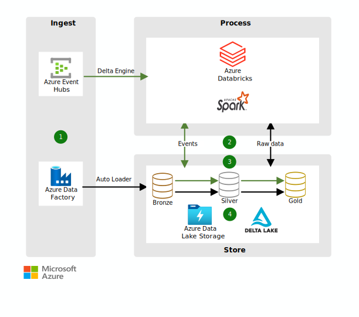

# ETL
## Introduction
In this section is described how the following operational aspects are addressed:
- Extract data from different data sources, Transform it to the underlying data model, then Load it to the desired storage location.
- Dealing with structured and unstructured data sources.
- Scalability in order to process & serve behavioral data of billions of customers worldwide.
- Support of various trigger mechanisms that would invoke data extraction and ingestion.

## Solution
The solution proposed involves using Azure Databricks and Delta Lake to build ETL pipelines that efficiently ingest, transform, and store data. It leverages Azure Data Factory for orchestrating workflows, Azure Data Lake Storage for handling various data types, and Delta Lake for ensuring data reliability and performance. The architecture supports scalable processing of structured and unstructured data and accommodates diverse triggering mechanisms for data extraction and ingestion, making it suitable for handling large-scale data from billions of customers.

Here below a representation of the architecture:

## Deep Dive
Let's address each operational challenge one by one.

### <u>Extract, Transform, Load (ETL)</u>

1. Data is ingested in the following ways:
    - Event queues like Event Hubs, IoT Hub, or Kafka send streaming data to Azure Databricks, which uses the optimized Delta Engine to read the data.
    - Scheduled or triggered Data Factory pipelines copy data from different data sources in raw formats. The Auto Loader in Azure Databricks processes the data as it arrives.
2. Azure Databricks loads the data into optimized, compressed Delta Lake tables or folders in the Bronze layer in Data Lake Storage.
3. Streaming, scheduled, or triggered Azure Databricks jobs read new transactions from the Data Lake Storage Bronze layer. The jobs join, clean, transform, and aggregate the data before using ACID transactions to load it into curated data sets in the Data Lake Storage Silver and Gold layers.
4. The data sets are stored in Delta Lake in Data Lake Storage.

Each service ingests data into a common format to ensure consistency. The architecture uses a shared data lake based on the open Delta Lake format. Raw data is ingested from different batch and streaming sources to form a unified data platform. The platform can be then used to retrieve data by the microservices.
For reference, here a short description of the main technologies involved in this approach:
- Azure Data Factory (ADF): This service orchestrates data workflows, enabling the movement of data from various sources into the desired storage locations. It supports both batch and pipeline data processing.
- Azure Databricks: A collaborative platform optimized for Apache Spark, enabling scalable data engineering tasks. Databricks can handle large datasets, perform transformations, and manage the overall ETL process efficiently.
- Delta Lake: An open-source storage layer that brings ACID transactions to Apache Spark and big data workloads. Delta Lake ensures data reliability and supports the efficient execution of ETL processes by maintaining a versioned history of data.

### <u>Dealing with Structured and Unstructured Data</u>
As described in the step before, this architecture is suitable for both structured and unstructured data, in terms of ingestion, processing, and storage.
This is possible thanks to:
- Azure Data Lake Storage (ADLS): A scalable and secure data lake for high-performance analytics workloads. ADLS can store structured, unstructured, and semi-structured data, providing a unified storage platform.
- Azure Databricks: Facilitates the processing and transformation of both structured and unstructured data. Its support for various data formats (JSON, CSV, Avro, Parquet, etc.) and scalable compute resources makes it ideal for diverse data processing needs.

    NOTE: Databricks has recently develop services to efficiently host and manage vector databases,  databases that are optimized to store and retrieve embeddings, speeding up the time to market of GenAI solutions.

### <u>Scalability</u>

Scaling the ETL process to handle the behavioral data of billions of customers worldwide involves managing massive amounts of data, efficiently allocating and scaling compute resources, ensuring data integrity and transactionality at scale, and maintaining high performance.
The technologies chosen to be part of the proposed architecture allow scalability.
Here below it is explained why:

- Azure Databricks
    - Auto-scaling: Databricks Jobs dynamically adjusts the number of compute nodes based on workload requirements. This ensures optimal resource usage and cost efficiency.
    - Cluster Management: Allows for the configuration of clusters that can automatically scale up or down, providing the necessary computational power during peak times and scaling back during off-peak periods.
    - Spark Optimizations: Utilizes Apache Spark’s inherent capabilities for distributed data processing, which can parallelize tasks across multiple nodes, improving processing speeds.

2. Delta Lake
    - ACID Transactions: Ensures data reliability through atomicity, consistency, isolation, and durability, which are crucial for data integrity, especially when dealing with concurrent writes and reads.
    - Data Compaction and Z-ordering: Optimizes data layout and indexing, which reduces the amount of data scanned during queries, significantly improving performance.
    - Scalable Metadata Handling: Delta Lake efficiently manages metadata for large tables, ensuring that even as data volume grows, query performance remains high.

3. Azure Data Lake Storage (ADLS)
    - Dynamic Partitioning: Using Azure Data Factory or Databricks, data can be ingested and dynamically partitioned based on defined rules.
	-	Elasticity: Provides a scalable storage solution that can grow with the data needs, supporting both small-scale and large-scale data without any performance degradation.
	-	High Throughput: Designed to handle large-scale analytics workloads with high throughput, ensuring that data ingestion and retrieval are efficient.

4. Azure Event Hubs and IoT Hub

	-	Event Streaming: Capable of ingesting and processing millions of events per second, making it suitable for real-time analytics and data streaming scenarios.
	-	Partitioning: Enables data partitioning, which allows for parallel processing of events, ensuring that the system can handle a large volume of incoming data without bottlenecks.

### <u>Support of Various Trigger Mechanisms </u>

The technologies included in the proposed architecture support multiple trigger mechanisms. Here below a short description:

1.	Azure Data Factory (ADF) Triggers
    - Schedule Triggers: Initiate pipelines at specified intervals using cron expressions (e.g., hourly, daily).
    - Event-based Triggers: Respond to events such as new data arrival in ADLS or changes in Azure Blob Storage.
    - Manual/Custom Triggers: Start pipelines manually or via external API calls, enabling integration with other applications.
2.	Azure Event Hubs & IoT Hub
    - Event Streaming: Handles real-time data ingestion from diverse sources.
    - Device-to-Cloud Messaging: Ingests data from IoT devices with bi-directional communication.
    - Event-Driven Architecture: Triggers data processing pipelines upon data reception from connected devices.
