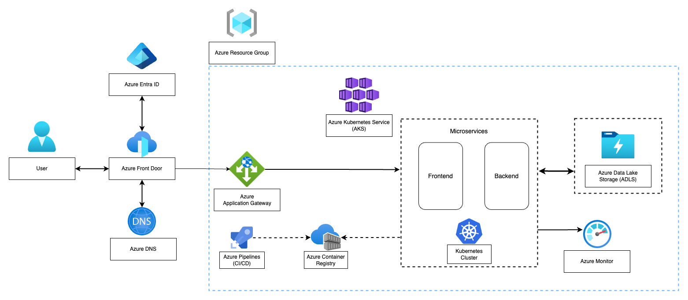

# Platform
## Introduction
This Azure-based cloud architecture is a robust and versatile solution designed to meet the demands of HPS, a product that handles high volume of data and wants to be used worldwide. Its foundation in scalable, secure, and high-performance components makes it an ideal choice for businesses seeking to build resilient and efficient systems. The architecture’s core advantage lies in its ability to scale elastically, handling varying workloads with ease. This is facilitated by Azure Kubernetes Service (AKS), which orchestrates the deployment, scaling, and operations of containerized applications, ensuring that both frontend and backend services can dynamically adjust to user demand.

High availability and resilience are intrinsic to this design, with Azure Front Door providing global load balancing and Azure Application Gateway managing regional traffic distribution. These elements work in tandem to ensure that the application remains accessible and performs optimally even under heavy traffic or regional outages. Security is another paramount feature of this architecture. Azure Entra ID (formerly Azure Active Directory) ensures secure user authentication and authorization, managing access efficiently.

The containerized deployment managed by AKS ensures efficient resource utilization, further boosting application performance. Cost efficiency is achieved through Azure’s pay-as-you-go model, allowing businesses to pay only for the resources they use, thus optimizing operational expenses, or through yearly commitment which allows to obtain a substantial discount.

Flexibility and agility are embedded in the architecture through its microservices approach, allowing independent development, deployment, and scaling of application components. This, combined with continuous integration and continuous deployment (CI/CD) pipelines provided by Azure Pipelines, enables rapid and reliable application updates. Comprehensive monitoring and management are provided by Azure Monitor, offering deep insights into application performance and health, enabling proactive management and quick troubleshooting. The use of Azure Resource Groups further simplifies resource management, deployment, and access control.

Here below the architecture diagram.

## Deep Dive
Let's now analyze each component of the proposed architecture, defining its role and main features.

1.	User:
    - Role: End user accessing the application, the decision makers.
    - Features: Interface to interact with the system, send requests, and receive responses.

2.	Azure DNS:
    - Role: Domain name resolution.
    - Features: Converts domain names into IP addresses, enabling users to access services using human-readable names.

3.	Azure Front Door:
    - Role: Helps load balance traffic across regions.
    - Features:
        - Distributes incoming traffic across multiple regions.
        - Enhances application performance through global HTTP load balancing.
        - Provides SSL offloading and web application firewall (WAF) capabilities.

4.	Azure Entra ID (Azure Active Directory):
    - Role: Identity and access management.
    - Features:
        - Provides secure authentication and authorization.
        - Manages users, groups, and permissions.
        - Supports multi-factor authentication (MFA) and single sign-on (SSO).

5.	Azure Application Gateway:
    - Role: Routes and load-balances traffic internally in the application to the various services that satisfy client business needs.
    - Features:
        - Distributes traffic within the Azure region.
        - Ensures efficient and secure routing of requests to the microservices, acting as Gateway API.

6.	Azure Kubernetes Service (AKS):
    - Role: Orchestrate deployment, scaling, and operations of containerized applications.
    - Features:
        - Manages Kubernetes clusters.
        - Automates provisioning, upgrade, monitoring, and scaling of resources.
        - Supports integration with Azure services like Azure Container Registry.

7.	Microservices (Frontend and Backend):
    - Role: Core application components divided into frontend and backend services.
    - Features:
        - Frontend handles user interface and user interactions.
        - Backend processes business logic, data access, and other core functionalities.
        - Deployed and managed as containers within the AKS cluster.

8.	Azure Data Lake Storage (ADLS):
    - Role: Scalable data storage for big data analytics (further details in the [ETL documentation](etl)).
    - Features:
        - Stores large volumes of structured and unstructured data.
        - Provides high-throughput and low-latency access to data.
        - Supports integration with various data processing and analytics tools.

9.	Azure Monitor:
    - Role: Monitoring and diagnostics.
    - Features:
        - Collects, analyzes, and acts on telemetry data from Azure environments, such as microservices performance.
        - Provides insights into application performance, availability, and health.
        - Offers alerting, visualization, and automated actions based on monitoring data.

10.	Kubernetes Cluster:
    - Role: Container orchestration environment.
    - Features:
        - Runs and manages containers.
        - Provides scalability, high availability, and fault tolerance.
        - Supports rolling updates and self-healing mechanisms.

11.	Azure Container Registry:
    - Role: Container image repository.
    - Features:
        - Stores and manages container images.
        - Integrates with AKS for seamless deployment.
        - Ensures secure and efficient distribution of container images.

12.	Azure Pipelines (CI/CD):
    - Role: Continuous Integration and Continuous Deployment.
    - Features:
        - Automates build, test, and deployment processes.
        - Ensures rapid and reliable delivery of application updates.
        - Integrates with source control (Azure Repos, Github, Gitlab) and other development tools.

13.	Azure Resource Group:
    - Role: Logical container for Azure resources.
    - Features:
        - Groups related resources for management and organization.
        - Facilitates resource deployment, monitoring, and access control.
